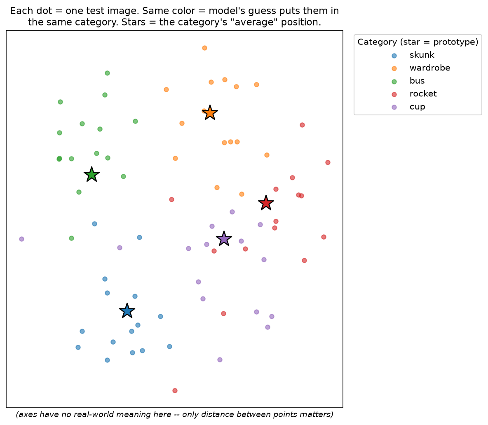
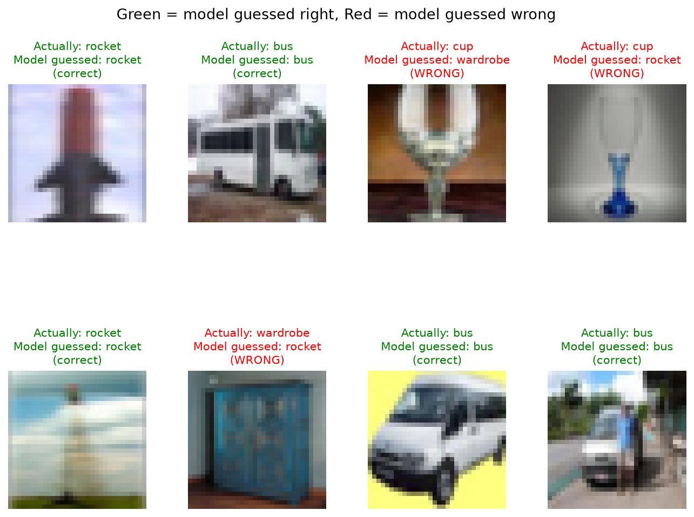

# Few-Shot Image Classification via Meta-Learning (Prototypical Networks)

A complete PyTorch implementation of few-shot image classification comparing **Prototypical Networks** (*Snell et al., NeurIPS 2017*) against a standard supervised CNN baseline on **CIFAR-100** (CIFAR-FS style 64/16/20 split).

---

## 📌 Project Overview

Instead of standard classification that memorizes fixed classes, meta-learning ("learning to learn") trains the model on thousands of few-shot episodic classification tasks. The goal is to classify completely unseen image categories at test time given only a handful of examples (e.g., 5 images per class in a 5-way 5-shot setup).

### Key Features
- **Prototypical Networks Implementation**: Metric-based meta-learning computing class prototypes and Euclidean distance nearest-neighbor queries.
- **Fair Baseline Comparison**: Supervised Conv-4-64 baseline fine-tuned at test time on the support set.
- **Pre-trained Weights Included**: Pre-trained weights (`protonet_encoder.pt` & `baseline_encoder.pt`) are included (~465 KB each) for instant testing without hours of retraining.
- **Comprehensive Visualizations**: t-SNE embedding clusters and qualitative prediction grids.
- **Reproducible Data Splits**: Fixed seed split of CIFAR-100 into 64 train, 16 validation, and 20 held-out test classes.

---

## 📁 Repository Structure

```text
├── data.py                  # Downloads CIFAR-100, splits classes, builds episodic sampler
├── models.py                # Conv-4-64 encoder backbone and Prototypical loss logic
├── train_protonet.py        # Meta-trains Prototypical Network across episodes
├── train_baseline.py        # Trains standard supervised CNN baseline
├── evaluate.py              # Evaluates both models on unseen test classes (mean ± 95% CI)
├── visualize.py             # Generates t-SNE plot and example predictions grid
├── requirements.txt         # Project dependencies
├── protonet_encoder.pt      # Pre-trained Prototypical Network encoder weights
├── baseline_encoder.pt      # Pre-trained Baseline encoder weights
├── tsne_embeddings.png      # Generated t-SNE visualization
└── example_predictions.png  # Generated sample predictions visual
```

---

## ⚙️ Installation & Setup (For Anyone Running This PC)

### 1. Prerequisites
- **Python**: Version 3.8 to 3.12 recommended
- **Git**: Installed on your system
- A GPU (NVIDIA CUDA) is supported but **not required** (runs seamlessly on CPU).

---

### 2. Clone the Repository
Open your terminal (or Command Prompt / PowerShell) and run:
```bash
git clone https://github.com/<YOUR-USERNAME>/<YOUR-REPO-NAME>.git
cd <YOUR-REPO-NAME>
```

---

### 3. Create and Activate a Virtual Environment

- **On Windows (PowerShell / Command Prompt):**
  ```powershell
  python -m venv venv
  .\venv\Scripts\activate
  ```
  *(If you encounter execution policy restrictions in PowerShell, run `Set-ExecutionPolicy -Scope Process -ExecutionPolicy Bypass` first).*

- **On macOS / Linux:**
  ```bash
  python3 -m venv venv
  source venv/bin/activate
  ```

---

### 4. Install Dependencies

Install all required packages via `requirements.txt`:
```bash
pip install --upgrade pip
pip install -r requirements.txt
```

> **Note for NVIDIA GPU users (optional):**  
> If you have an NVIDIA GPU and want CUDA acceleration, install PyTorch with CUDA support:
> ```bash
> pip install torch torchvision --index-url https://download.pytorch.org/whl/cu121
> ```

---

## 🚀 Quick Start (Testing in 1 Minute)

Because pre-trained model weights (`protonet_encoder.pt` and `baseline_encoder.pt`) are included, you do **not** need to wait for training to test the project!

### Step 1: Compare Both Models on Unseen Test Classes
```bash
python evaluate.py --n_episodes 300 --n_way 5 --k_shot 5
```
*Note: On first run, CIFAR-100 will download automatically into `./data/` (~170 MB).*

### Step 2: Generate Visualizations
```bash
python visualize.py
```
This generates:
- `tsne_embeddings.png` (t-SNE clustering of query embeddings with prototypes marked)
- `example_predictions.png` (sample test query predictions)

---

## 🏋️ Training Models From Scratch

If you wish to re-train the models from scratch:

### 1. Meta-Train the Prototypical Network
```bash
python train_protonet.py --iterations 5000 --n_way 5 --k_shot 5 --q_query 15
```
*Quick run (faster convergence for testing):*
```bash
python train_protonet.py --iterations 2000
```

### 2. Train the Standard Baseline Classifier
```bash
python train_baseline.py --epochs 30
```
*Quick run:*
```bash
python train_baseline.py --epochs 15
```

---

## 📊 Visualizations

| t-SNE Query Embeddings & Prototypes | Qualitative Predictions Sample |
| :---: | :---: |
|  |  |

---

## 🧠 Understanding the Moving Parts

1. **Episodic Meta-Learning**: Instead of learning fixed class boundaries, the model encounters thousands of small few-shot tasks ("episodes") with changing classes. It learns how to extract discriminative features that transfer to novel categories.
2. **N-way K-shot**: Each task contains $N$ classes with $K$ labeled support examples each, plus query examples to classify.
3. **Prototypical Networks**:
   - Computes a class prototype $c_k = \frac{1}{|S_k|} \sum_{(x_i, y_i) \in S_k} f_\theta(x_i)$ by averaging support embeddings.
   - Assigns queries using softmax over negative Euclidean distances:
     $$P(y = k \mid x) = \frac{\exp(-d(f_\theta(x), c_k))}{\sum_{k'} \exp(-d(f_\theta(x), c_{k'}))}$$
4. **Baseline Comparison**: A standard supervised CNN trained on base classes with a newly initialized linear layer fine-tuned on the few-shot support set at test time.

---

## 📚 References

- Snell, Swersky, Zemel. *"Prototypical Networks for Few-shot Learning."* NeurIPS 2017.
- Vinyals et al. *"Matching Networks for One Shot Learning."* NeurIPS 2016.
- Finn, Abbeel, Levine. *"Model-Agnostic Meta-Learning for Fast Adaptation of Deep Networks (MAML)."* ICML 2017.
- Bertinetto et al. *"Meta-learning with differentiable closed-form solvers."* ICLR 2019.
